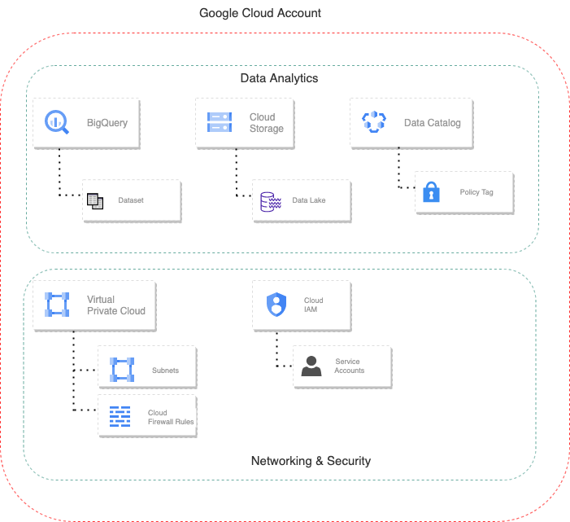

# Bigquery Pilot Project
Deploy end to end BQ pilot project in your google cloud env. 

## Deploying using Cloud Shell
You can deploy this to a new project or an existing project.
- New Project:
  - This requires you to be an Org Admin.  This is a great for personal projects or if IT is running the script.
- Existing Project:
  - This requires a project to be created in advance.  IT typically will create and provide a service account which is used to deploy.  Or IT can allow you to impersonate the service account (more secure then exporting a JSON credential file)

### To deploy to New Project (Preferred method)
1. Open a Google Cloud Shell: http://shell.cloud.google.com/ 
2. Type: git clone https://github.com/yadavj2008/data-analytics-pilot.git
3. Switch the prompt to the directory: cd data-analytics-pilot
4. Run the deployment script: source run.sh  
5. Authorize the login (a popup will appear)
6. Follow the prompts: Answer “Yes” for each.

### To deploy to an Existing Project
1. Review the code in the deploy-use-existing-project.sh
2. You should have a project and a service account with the Owner role
3. You will just hard code the project and service account information into the script.  The script has code in it to "emualte" someone else creating a project.  

### After the deployment
1. If you are choose new project then the terraform script will create a new project called "bigquery-pilot-xxxxx" in your cloud env.
2. The script will create a service account through which terraform will Enables APIs, create resources like Bigquery dataset, VPC, subnet, firewall policies etc. 

### Possible Errors:
1. If the script fails to enable a service or timeouts, you can rerun and if that does not work, run ./clean.sh and start over
2. If the script has security type message (unauthorized), then double check the configure roles/IAM security.
3. If you get the error "Error: Error when reading or editing Project Service : Request `List Project Services bigquery-pilot-xxxxxxxxx` returned error: Failed to list enabled services for project bigquery-pilot-xxxxxxxxx: Get "https://serviceusage.googleapis.com/v1/projects/bigquery-demo-xxxxxxxxx/services?alt=json&fields=services%2Fname%2CnextPageToken&filter=state%3AENABLED&prettyPrint=false".  You need to start over.  Run ./clean.sh and then run source deploy.sh again.  This is due to the service usage api not getting propagated with 4 minutes...
  - Delete your failed project

## Folders
- terraform
  - the entry point for when deploying this using a service account 
- terraform-modules
  - project - creates the cloud project if a project number is not provided
  - resouces - the main set of resources to deploy
  - service-account - creates a service account if a project numnber is not provided.  The service account will be impersonated during the deployment.
  - service-usage - enables the service usage API as the main user (non-impersonated)
- terraform-local
  - the entry point for when deploying via cloud shell or your local machine.  This uses service account impersonation
